# ACTS Development setup

## Native spack

> [!WARNING]
> Spack builds packages from source. We have a so-called *buildcache* which has
> a number of packages in binary form. However, this does not always work 100%
> reliably, largely due to ROOT shenanigans, but sometimes also due to
> compiler/os/library incompatibilities, and the build recipes not having been
> updated (yet).
> We have some documentation on using Spack for the dependencies [on the
> documentation](https://acts.readthedocs.io/en/latest/misc/spack.html). Be
> prepared to troubleshoot if you go this route.

## Docker images

The ACTS continuous integration system relies on dependency builds using spack
with the method discussed above. To avoid having to run this build process
yourself, even with the build-cache, you can
[find](https://github.com/orgs/acts-project/packages/container/package/spack-container)
a number of Docker images, which already have all the build artifacts stored
inside of them. With these images, you're ready to go to compile ACTS with the
Examples framework and run the demonstration pipelines.

> [!NOTE]
> You already need to have Docker installed on your system for this to work.
> You can find instructions on how to install Docker at
> [docker.com](https://www.docker.com/). There are also alternative software
> packages like [OrbStack](https://orbstack.dev) On macOS, you can also check
> out [Colima](https://github.com/abiosoft/colima).

To get started, you need to pick on of the compatible Docker images. For this
tutorial, we're going to pick the **Ubuntu 24.04** flavor with GCC 13.3.0, and
you'll have to pick one of the below images, depending on your processor
architecture:

- `x86_64` (older Intel based Macs, and most other laptops) `ghcr.io/acts-project/spack-container:9.2.0_linux-ubuntu24.04-x86_64_gcc-13.3.0`
- `aarch64` (newer Macs with M-series processors) `ghcr.io/acts-project/spack-container:9.2.0_linux-ubuntu24.04-aarch64_gcc-13.3.0`

First, you'll need to *pull* the image using the following command, where
`$IMAGE` refers to the choice you made above

```console
docker pull $IMAGE
```

This should download the image to your local machine and make it ready to use.
The next step is to run a Docker container using these images. Docker has the
concept of *volume* that are mounted into the container. Volumes are the main
way you can share files between the host and the container. You have the option
to work fully inside of the container, but that means if you remove the
container, everything you did inside of it will be lost. The other option is to
mount one or more directories from the host into the container, so that their
contents are kept between container runs.

Volumes are controlled using the `-v` option to the Docker CLI. What we're
going to do is this:

- Start a container with our ACTS working directory mounted into the container
- Clone the ACTS repository into that working directory
- Compile and run ACTS

To get started, choose some directory on your host machine that will become the
working directory, for example `/home/username/acts-workshop/`. Open a terminal
in that directory, and run the following command:

```console
docker run --rm -it -v $WORK:/work -w /work $IMAGE
```

where `$WORK` is the host directory that you picked as the working directory.

This will launch a container based on `$IMAGE`. `-v $PWD:/work` will mount your
current working directory into the container under `/work`, and `-w /work` will
make Docker put you into that directory as soon as you enter the container.
`--rm` will delete the container as soon as it stops, which is generally good
practice, as it cleans up after itself this way. `-it` starts an interactive
session and makes the container present the connection as an interactive
terminal, which essentially means that you can interact with the container as
if it was a normal shell.

You should now see in your shell the prompt from inside the container. You can
confirm the current working directory by typing

```console
$ pwd
/work
```

and inspecting the output. This should read `/work`.

## Building and running

### Clone ACTS

The next step is to clone the ACTS repository. You can do this either on the
host or in the container. Doing it inside the container has the benefit, that
`git-lfs` is already installed there. It is needed to clone the
*OpenDataDetector* repository, which uses is to store some of the input files
that we're going to need to run the Example workflow.

In the container run the following command to clone the ACTS repository:

```console
git clone https://github.com/acts-project/acts.git --recursive
```

The `--recursive` flag is important, because that will make git also clone the
OpenDataDetector repository, which is included as a git *submodule*.

After this command completes, you should have a directory called `acts` in your
working directory. You can now make sure that the repository is also visible on
the host, to make sure that the volume mounting worked correctly.

### Build ACTS

To build ACTS, CMake is used. CMake gives you a number of options that control
what parts of ACTS are going to be built, and in what configuration. For the
purpose of this tutorial, we want to build the *Examples framework* and the
*OpenDataDetector*, so that we can run a basic workflow using it. You can find
a list of available build options
[here](https://acts.readthedocs.io/en/latest/getting_started.html#build-options).

After having cloned the repository, you
can run the following CMake command. This will use a CMake *preset* to
configure most of the aforementioned options. The two modifications that we
make is that we turn off building of the unit and integration tests. These add
some amount of time to the build, and they are very useful in general, but for
this session we will not need them.

```console
$ cmake -S $SOURCE_DIR -B build -G Ninja --preset dev -DACTS_BUILD_UNITTESTS=OFF -DACTS_BUILD_INTEGRATIONTESTS=OFF -DACTS_BUILD_EXAMPLES_PYTHIA8=ON -DACTS_BUILD_EXAMPLES_GEANT4=ON
Preset CMake variables:

  ACTS_BUILD_EXAMPLES_DD4HEP="ON"
  ACTS_BUILD_EXAMPLES_PYTHON_BINDINGS="ON"
  ACTS_BUILD_EXAMPLES_ROOT="ON"
  ACTS_BUILD_EXAMPLES_UNITTESTS="ON"
  ACTS_BUILD_FATRAS="ON"
  ACTS_BUILD_ODD="ON"
  ACTS_BUILD_PLUGIN_LEGACY="ON"
  ACTS_ENABLE_LOG_FAILURE_THRESHOLD="OFF"
  ACTS_FORCE_ASSERTIONS="ON"
  CMAKE_BUILD_TYPE="RelWithDebInfo"
  CMAKE_CXX_COMPILER_LAUNCHER="ccache"
  CMAKE_CXX_STANDARD="20"
  CMAKE_EXPORT_COMPILE_COMMANDS="ON"

... many more lines

-- The CXX compiler identification is GNU 13.3.0
-- Detecting CXX compiler ABI info
-- Detecting CXX compiler ABI info - done
-- Check for working CXX compiler: /usr/bin/c++ - skipped
-- Detecting CXX compile features
-- Detecting CXX compile features - done
-- Using compiler flags: -Wall -Wextra -Wpedantic -Wshadow -Wzero-as-null-pointer-constant -Wold-style-cast -D_GLIBCXX_ASSERTIONS -D_LIBCPP_DEBUG
-- Configuring done (7.5s)
-- Generating done (0.4s)
-- Build files have been written to: /work/build
```

Here, `$SOURCE_DIR` is the clone of ACTS that you created before. If you're
using the same paths, it should be `/work/acts` or just `acts` if you're in the
`/work` directory. The `-B build` option sets the build directory. `-G Ninja`
configures the build to use the [Ninja](https://ninja-build.org/) task runner,
instead of the default of Make.

This command should complete without errors and locate all the external
software that you downloaded as part of the Docker image. This step is called
the *configuration step*, as it uses CMake to configure the project, so that we
can actually build it in the next step.

> [!TIP]
> **Persist `ccache` caches**
> We are going to use [ccache](https://ccache.dev/) in our builds.
> `ccache` intercepts compiler invocations and caches the result, which can speed
> up subsequent builds. By default, `ccache` will only store these caches inside
> the container, meaning that they will be lost when the container is deleted.
> To void this, you can mount a host directory into the container at the
> location where `ccache` stores its caches. In the images above, this directory
> is `/ccache` in the container. You can therefore mount a host directory into
> this location using `-v$WORK:/ccache` to persist caches between container
> launches.
>
> You'll want to do this before you run the build for the first time!

To build the project, you can use the following command:

```console
cmake --build build
```

Since we told CMake to use Ninja above, this will use all available CPU cores,
as that's the default for Ninja.

> [!WARNING]
> The ACTS build requires a fair amount of memory, especially if you build with
> many CPU cores at the same time. You will likely need about 2-3G of memory
> per CPU core.
>
> On macOS, where Docker runs inside a virtual machine, the available resources
> not only depend on your machine, but also on the configuration of that VM. If
> you get issues with the build failing because it's running out of memory you
> can try the following:
>
> - Decrease the number of cores that Ninja uses by running `cmake --build --
>   -j$N`, where `N` is the number of CPU cores to use.
> - Reconfigure the VM to have additional resources. How to do this depends on
>   you set up Docker.

After the build has completed, you can now run the Example script. If you're on
macOS, you might encounter a number of warnings related to GCC. See
[here](#warning-about-change-in-parameter-passing-in-gcc11) for details.

### Installing Geant4 datafiles

The example workflow script has the ability to run the simulation itself using
Geant4. For this to work, Geant4 needs to have access to a set of data files.
You can download these files with the following command, they should then
automatically be picked up at runtime

```console
geant4-config --install-datasets
```

> [!TIP]
> **Persist Geant4 data files**
> Similar to `ccache`, you can store the Geant4 data files
> on the host, rather than in the container, to allow reusing them between
> container launches. Geant4 will download dataset files into the container
> directory `/g4data`. You can therefore mount a host directory into this
> location using `-v$WORK:/g4data` to persist the data files between container
> launches.

### Run the ODD workflow example

This example uses the [OpenDataDetector](), which is a general virtual detector, with realistic material and an HL-LHC inspired layout, featuring an all-silicon tracker.

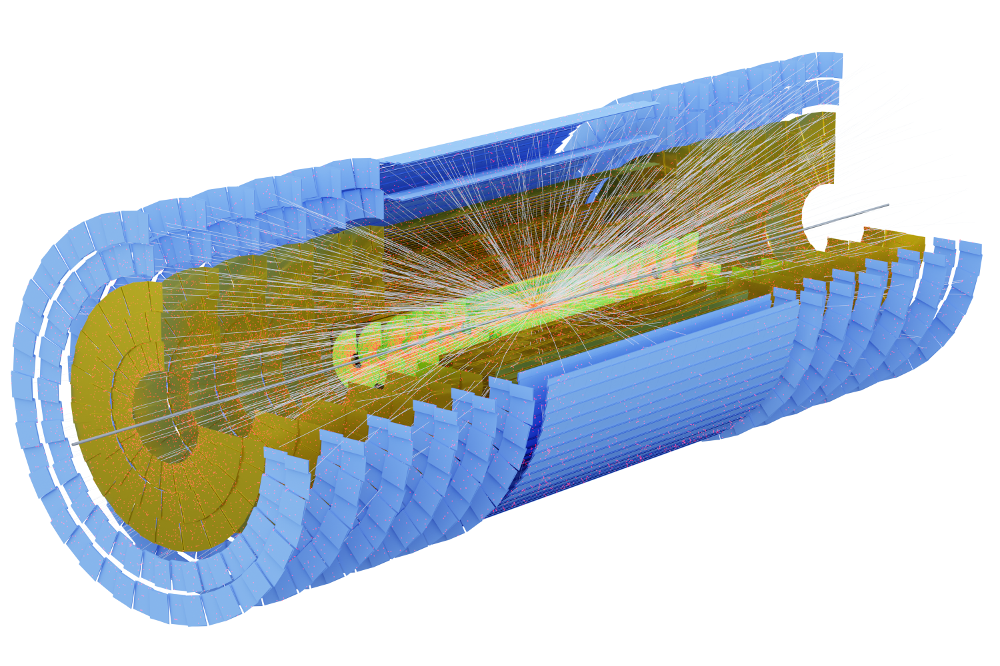

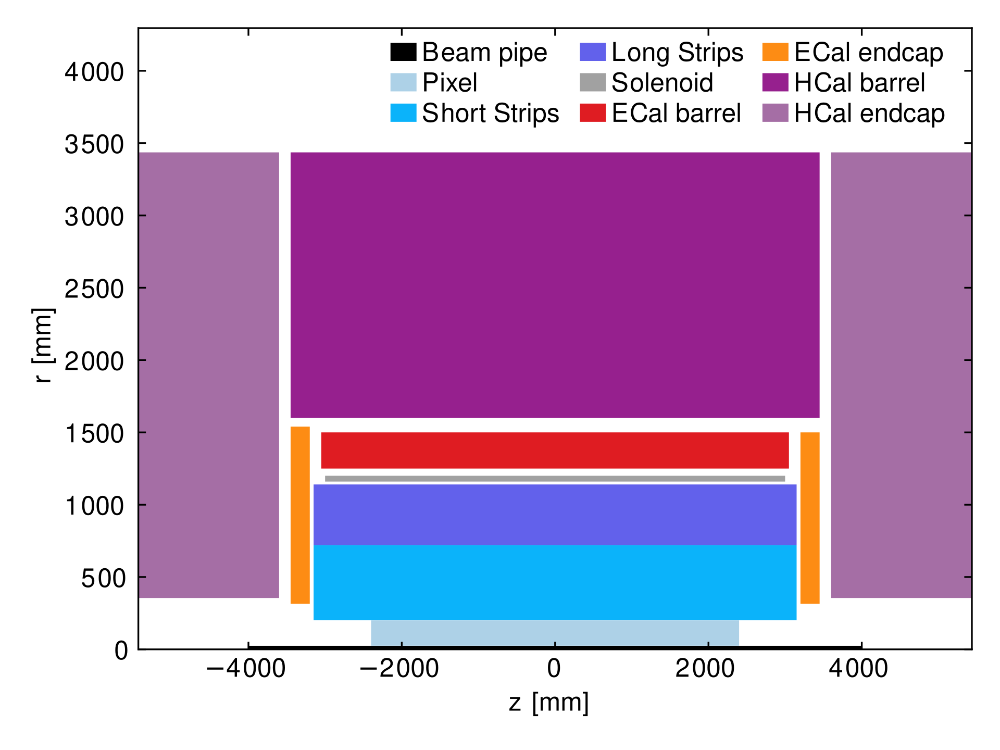

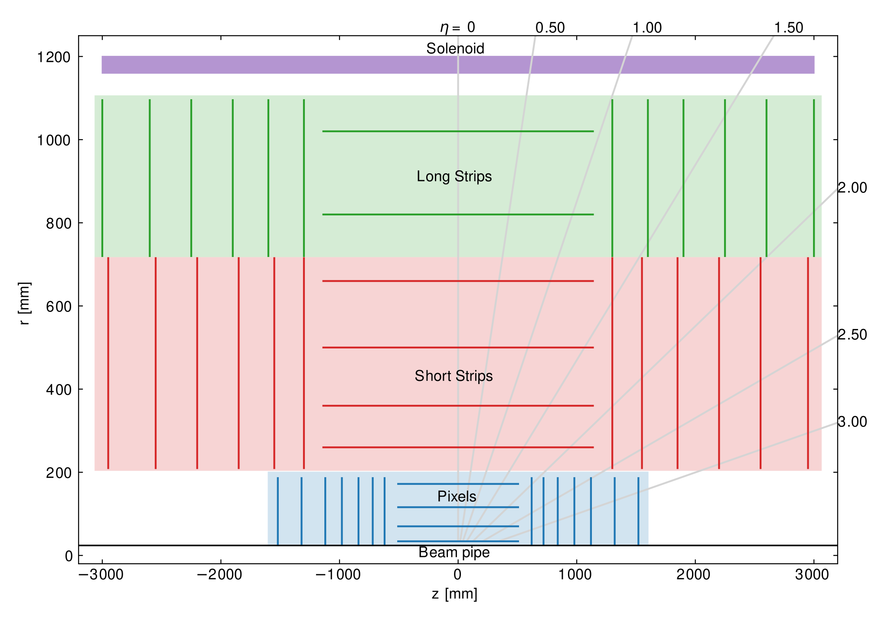

First, you have to load the runtime environment. The ACTS build produces a setup script which sets all the required environment variables for the ACTS Examples framework, in addition to activate dependency libraries like ROOT, DD4hep and Geant4. You can load this script using the following command:

```console
$ source build/this_acts_withdeps.sh
INFO:    Found OpenDataDetector and set it up
INFO:    Acts Python 3.13 bindings setup complete.
```

Now you should be able to run the main OpenDataDetector script. It has a number of command line arguments and options, which you can list using `--help`:

```console
$ Examples/Scripts/Python/full_chain_odd.py --help
usage: full_chain_odd.py [-h] [--output OUTPUT] [--events EVENTS] [--skip SKIP] [--edm4hep EDM4HEP] [--geant4] [--ttbar] [--ttbar-pu TTBAR_PU] [--gun-particles GUN_PARTICLES]
                         [--gun-multiplicity GUN_MULTIPLICITY] [--gun-eta-range GUN_ETA_RANGE GUN_ETA_RANGE] [--gun-pt-range GUN_PT_RANGE GUN_PT_RANGE] [--digi-config DIGI_CONFIG]
                         [--material-config MATERIAL_CONFIG] [--ambi-solver {greedy,scoring,ML}] [--ambi-config AMBI_CONFIG] [--MLSeedFilter] [--reco | --no-reco]
                         [--output-root | --no-output-root] [--output-csv | --no-output-csv] [--output-obj | --no-output-obj]

Full chain with the OpenDataDetector

options:
  -h, --help            show this help message and exit
  --output, -o OUTPUT   Output directory
  --events, -n EVENTS   Number of events
  --skip, -s SKIP       Number of events
  --edm4hep EDM4HEP     Use edm4hep inputs
  --geant4              Use Geant4 instead of fatras
  --ttbar               Use Pythia8 (ttbar, pile-up 200) instead of particle gun
  --ttbar-pu TTBAR_PU   Number of pile-up events for ttbar
  --gun-particles GUN_PARTICLES
                        Multiplicity (no. of particles) of the particle gun
  --gun-multiplicity GUN_MULTIPLICITY
                        Multiplicity (no. of vertices) of the particle gun
  --gun-eta-range GUN_ETA_RANGE GUN_ETA_RANGE
                        Eta range of the particle gun
  --gun-pt-range GUN_PT_RANGE GUN_PT_RANGE
                        Pt range of the particle gun (GeV)
  --digi-config DIGI_CONFIG
                        Digitization configuration file
  --material-config MATERIAL_CONFIG
                        Material map configuration file
  --ambi-solver {greedy,scoring,ML}
                        Set which ambiguity solver to use, default is the classical one
  --ambi-config AMBI_CONFIG
                        Set the configuration file for the Score Based ambiguity resolution
  --MLSeedFilter        Use the Ml seed filter to select seed after the seeding step
  --reco, --no-reco     Switch reco on/off
  --output-root, --no-output-root
                        Switch root output on/off
  --output-csv, --no-output-csv
                        Switch csv output on/off
  --output-obj, --no-output-obj
                        Switch obj output on/off
```

- `Examples/Scripts/Python/full_chain_odd.py -n10 --gun-multiplicity 10`: Runs
  10 vertices of 4 muons each, simulated using ACTS' fast simulation
- `Examples/Scripts/Python/full_chain_odd.py -n10 --ttbar --ttbat-pu 10`: Runs
  $t\bar{t}$ events and 10 soft-QCD pile-up events, generated using Pythia8 and
  simulated using ACTS' fast simulation
- `Examples/Scripts/Python/full_chain_odd.py -n10 --ttbar --ttbat-pu 10
  --geant4`: Runs $t\bar{t}$ events and 10 soft-QCD pile-up events, generated
  using Pythia8 and simulated using Geant4

The script also has options to control which outputs to write. Some outputs are
useful for debugging, but can be slow to write. In particular, you will want to
add the options `--no-output-csv` and `--no-output-obj` to speed up processing
considerably.

## Discussion of the ODD *full chain* example script

### Core concepts

The Examples framework implements a fairly standard algorithm + event store
event processing loop:

- The **Sequencer** runs the event loop. It is configured by a sequencer of
elements, where an element can be one of three types:
  1. **Algorithms** are the main building block of the logic. They contain the
     majority of code that calls ACTS Core algorithms
  2. **Readers** are used to read in data, for example from one or more files.
     The *event generation* is also implement as a reader, even though it does
     not read individual events from disk.
  3. **Writers** write data out to one or more files in various formats.
  - The sequence elements exchange information via entries in the **event store**.
- We ship a set of helper functions in `acts.examples.reconstruction` and
`acts.examples.simulation` that accept a Sequencer and various configuration
arguments, and add multiple sequence elements to the sequencer to achieve some
goal, like setting up event generation, or running parts of a reconstruction
chain.

### Sequence description

The initial part of the script sets up the detector geometry. In this example,
the OpenDataDetector is used, so that's what is being set up.

```python
# Figures out the source directory based on the location of this script
geoDir = getOpenDataDetectorDirectory()

# The material map is loaded from the common directory, if it's not explicitly configured.
oddMaterialMap = (
    args.material_config
    if args.material_config
    else geoDir / "data/odd-material-maps.root"
)
```

The following part determines the digitization configuration for the job.
Digitization in this context essentially determines which elements of the
detector are considered *sensitive*, and which information is *measured*
(virtually) by that sensor.

```python
oddDigiConfig = (
    args.digi_config
    if args.digi_config
    else geoDir / "config/odd-digi-smearing-config.json"
)
```

This file is structured as a geometry identifier hierarchy, where common values
are applied to the full *subtree* under that identifier. For instance, the
following entry referencing volume 16 means that every sensitive surface with a
volume ID of 6 will be affected.

```json
{
  "volume": 16,
  "value": {
    "smearing": [
      { "index": 0, "stddev": 0.015, "type": "Gauss" },
      { "index": 1, "stddev": 0.015, "type": "Gauss" },
      { "index": 5, "stddev": 25, "type": "Gauss" }
    ]
  }
}
```

The file configures the digitization to use a smearing configuration. This
configuration will take a subset of the local particle parameters (selected by
the `index` key), and smear these values according to the associated
configuration. In the example, the smearing is carried out using Gaussian
smearing with different standard deviations.

The following lines located a selection configuration file for the seeding,
configures a utility that reads the material map and then applies it to the
active geometry. Finally, it runs `getOpenDataDetector` to actually construct
the tracking geometry.

```python

oddSeedingSel = geoDir / "config/odd-seeding-config.json"
oddMaterialDeco = acts.IMaterialDecorator.fromFile(oddMaterialMap)

detector = getOpenDataDetector(odd_dir=geoDir, mdecorator=oddMaterialDeco)
trackingGeometry = detector.trackingGeometry()
decorators = detector.contextDecorators()

```

```python
# Configures a constant B field along the z-axis.
field = acts.ConstantBField(acts.Vector3(0.0, 0.0, 2.0 * u.T))
# Configure a stable random number sequence
rnd = acts.examples.RandomNumbers(seed=42)

# Configuration of the sequencer that runs the whole event loop
s = acts.examples.Sequencer(
    events=args.events,
    skip=args.skip,
    numThreads=1 if args.geant4 else 1,
    outputDir=str(outputDir),
)
```

With the sequencer ready and instantiated, we can now start adding elements to it.

This section optionally configures simulation inputs from
[EDM4hep](https://github.com/key4hep/EDM4hep) instead of running an event
generation step. By default, this is off, meaning that events are generated on
the fly.

```python
if args.edm4hep:
    import acts.examples.edm4hep

    edm4hepReader = acts.examples.edm4hep.EDM4hepSimReader(
        inputPath=str(args.edm4hep),
        inputSimHits=[
            "PixelBarrelReadout",
            "PixelEndcapReadout",
            "ShortStripBarrelReadout",
            "ShortStripEndcapReadout",
            "LongStripBarrelReadout",
            "LongStripEndcapReadout",
        ],
        outputParticlesGenerator="particles_generated",
        outputParticlesSimulation="particles_simulated",
        outputSimHits="simhits",
        graphvizOutput="graphviz",
        dd4hepDetector=detector,
        trackingGeometry=trackingGeometry,
        sortSimHitsInTime=True,
        level=acts.logging.INFO,
    )
    s.addReader(edm4hepReader)

    s.addWhiteboardAlias("particles", edm4hepReader.config.outputParticlesGenerator)

    # Select a subset of particles based on particle properties. Only the
    # selected particles will be simulated, and will produce hits.
    addSimParticleSelection(
        s,
        ParticleSelectorConfig(
            rho=(0.0, 24 * u.mm),
            absZ=(0.0, 1.0 * u.m),
            eta=(-3.0, 3.0),
            pt=(150 * u.MeV, None),
            removeNeutral=True,
        ),
    )

```

If the `edm4hep` flag is off (which is the default), the script configures the
event generation. The script has two modes to do this:

- Particle gun
- Pythia8

With the particle gun, we can configure the event generation to produce a fixed
number of a specific particle type with a configurable distribution of particle
quantities like $p_T$, $\phi$ and $\theta$. The ranges for the randomized
particle properties can be configured using command line arguments.

```python
if args.edm4hep:
  ...
else:
    if not args.ttbar:
        addParticleGun(
            s,
            MomentumConfig(
                args.gun_pt_range[0] * u.GeV,
                args.gun_pt_range[1] * u.GeV,
                transverse=True,
            ),
            EtaConfig(args.gun_eta_range[0], args.gun_eta_range[1]),
            PhiConfig(0.0, 360.0 * u.degree),
            ParticleConfig(
                args.gun_particles, acts.PdgParticle.eMuon, randomizeCharge=True
            ),
            vtxGen=acts.examples.GaussianVertexGenerator(
                mean=acts.Vector4(0, 0, 0, 0),
                stddev=acts.Vector4(
                    0.0125 * u.mm, 0.0125 * u.mm, 55.5 * u.mm, 1.0 * u.ns
                ),
            ),
            multiplicity=args.gun_multiplicity,
            rnd=rnd,
        )
```

The alternative is running Pythia8
to generate $t\bar{t}$ events. The script restricts this generation to
$t\bar{t}$, but Pythia8 can of course be configured to generate many different
processes.

```python
if args.edm4hep:
  ...
else:
    if not args.ttbar:
      ...
    else:
        addPythia8(
            s,
            hardProcess=["Top:qqbar2ttbar=on"],
            npileup=args.ttbar_pu,
            vtxGen=acts.examples.GaussianVertexGenerator(
                mean=acts.Vector4(0, 0, 0, 0),
                stddev=acts.Vector4(
                    0.0125 * u.mm, 0.0125 * u.mm, 55.5 * u.mm, 5.0 * u.ns
                ),
            ),
            rnd=rnd,
            outputDirRoot=outputDir if args.output_root else None,
            outputDirCsv=outputDir if args.output_csv else None,
        )

        addGenParticleSelection(
            s,
            ParticleSelectorConfig(
                rho=(0.0, 24 * u.mm),
                absZ=(0.0, 1.0 * u.m),
                eta=(-3.0, 3.0),
                pt=(150 * u.MeV, None),
            ),
        )

```

As Pythia8 produces many particles, especially at low momentum, this selects
particles with at least 150MeV, and which are within 24mm of the beam axis.

> [!WARNING]
> The radial cut means that if Pythia8 is configured with a long-lived
> particle, its decay products will likely be filtered out by this selection
> criterion.

The `outputDirRoot` variable will instruct the event generation stage to
produce outputs for the truth particles and vertices before simulation. By
default this will be written in `particles.root` and `vertices.root` in the
`odd_output` directory.

We can look at the $p_T$ and $\eta$ distribution of the generated particles, as
well as the vertex position distribution. Here are some examples when
configured to generate $t\bar{t}$.

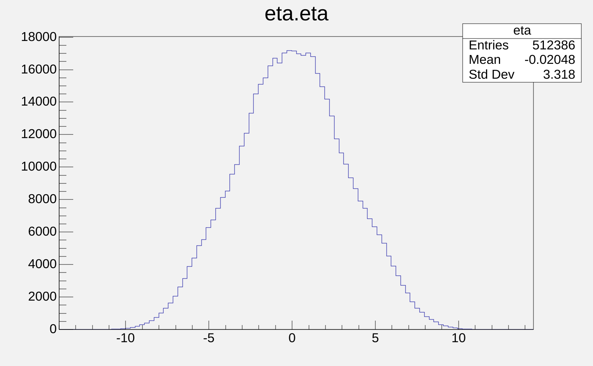

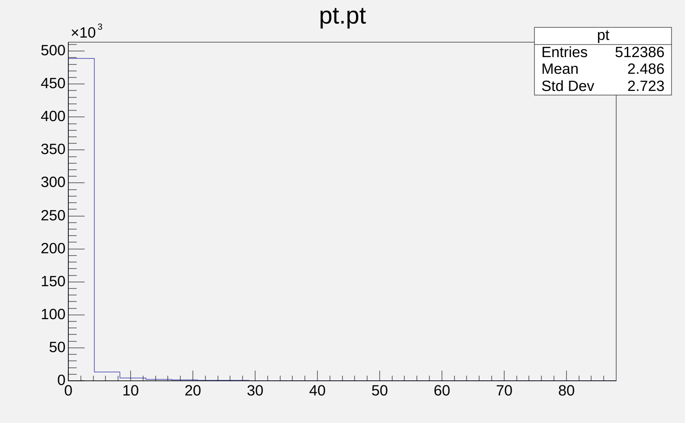

The vertex distribution exactly correspond to the configured vertex position smearing.

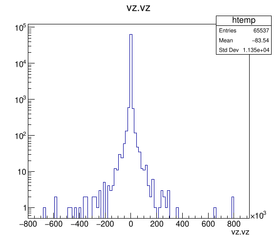

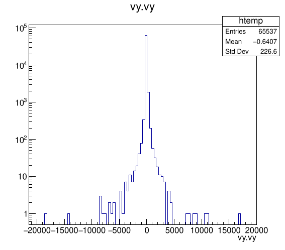

Next, the script configures the simulation of generated particles. The two
options here are

- Geant4, which is activated by the `--geant4` command line option
- ACTS Fast Simulation (FATRAS), which is the default

```python
    if args.geant4:
        if s.config.numThreads != 1:
            raise ValueError("Geant 4 simulation does not support multi-threading")

        addGeant4(
            s,
            detector,
            trackingGeometry,
            field,
            outputDirRoot=outputDir if args.output_root else None,
            outputDirCsv=outputDir if args.output_csv else None,
            outputDirObj=outputDir if args.output_obj else None,
            rnd=rnd,
            killVolume=trackingGeometry.highestTrackingVolume,
            killAfterTime=25 * u.ns,
        )
```

```python
    if args.geant4:
      ...
    else:
        addFatras(
            s,
            trackingGeometry,
            field,
            enableInteractions=True,
            outputDirRoot=outputDir if args.output_root else None,
            outputDirCsv=outputDir if args.output_csv else None,
            outputDirObj=outputDir if args.output_obj else None,
            rnd=rnd,
        )

```

In both cases, the sequence will write out root files containing the simulated
particles and the hits created by them during simulation. They are found in
`particles_simulated.root` and `hits.root` respectively.

The default particle gun transverse momentum distribution is flat between 1GeV
and 10GeV which is visible in the $p_T$ distribution of the simulated
particles.

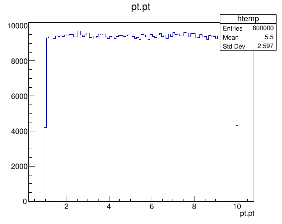

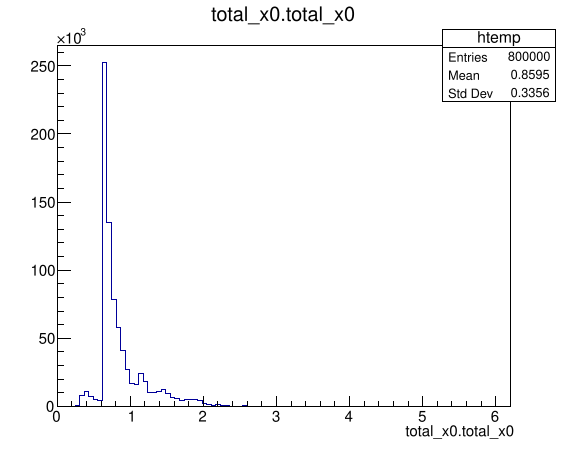
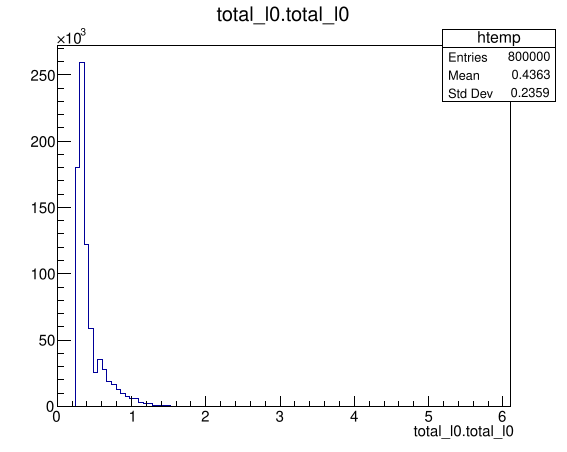

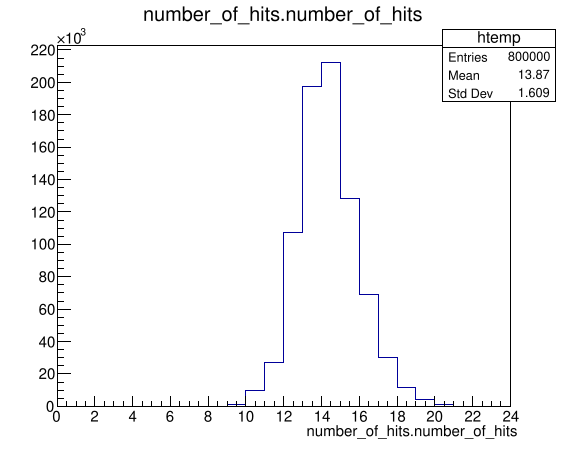

In the hits file, we can look at an $rz$ scatter plot, to see the location of
simulated hits.

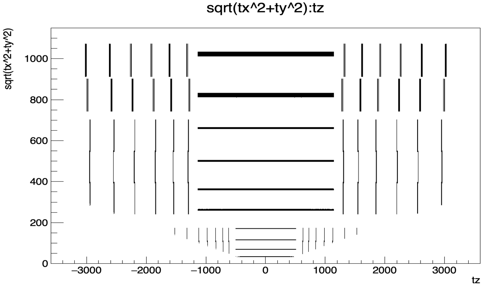

The next steps configures the digitization process discussed before. It accepts
the `oddDigiConfig` path that was derived in the beginning. The primary action
this function takes is add the `DigitizationAlgorithm` from the Examples
framework to the sequence. Note that this algorithm also runs the clustering,
in case that's required by the configuration, as ACTS' Examples framework are
designed to only run simulation workflows. In case of the smearing
digitization, no clusterization is needed.

```python
addDigitization(
    s,
    trackingGeometry,
    field,
    digiConfigFile=oddDigiConfig,
    outputDirRoot=outputDir if args.output_root else None,
    outputDirCsv=outputDir if args.output_csv else None,
    rnd=rnd,
)

```

The next step is again configuring a particle selection, but since we now know
the number of measurements for each particle, we can place a requirement on the
minimum number of measurements.

This stop writes out a root file at `measurements.root` containing information
the digitized and possibly clustered measurements. The most interesting
properties are the cluster positions in local 0 and local 1 in the local
coordinate system.

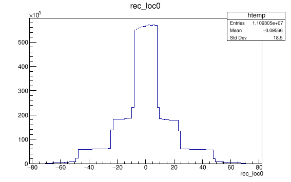
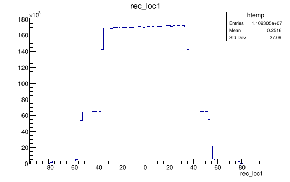

The shoulders in these distributions are associated with the different sensor
sizes in the respective directions. The output file also contains the true
position of the source hit of the cluster, which is essentially the same
information as in the simulated hits output file. We can also see the
uncertainties associated with the clusters, as well as pull (residual divided
by uncertainty) distributions. In the smeared digitization mode, the former
should correspond exactly with the smearing configuration, and the pull also
follows from it, e.g. with Gaussian smearing you will evidently expect a normal
pull distribution.

```python
addDigiParticleSelection(
    s,
    ParticleSelectorConfig(
        pt=(1.0 * u.GeV, None),
        eta=(-3.0, 3.0),
        measurements=(9, None),
        removeNeutral=True,
    ),
)

```

This marks the end of the simulation part, and we can now (optionally)
configure the reconstruction. The first step is the triplet seeding. There are
a number of  ways to run *seeding*:

- Full triplet seeding (Default)
- Truth smeared: make seeds from smeared particle parameters
- Truth estimated: make seeds from running the track parameter estimation based
  on the truth measurements of the particle
- Orthogonal range seeding
- a number of other seeding strategies.

They **should** be largely interchangeable, but some tuning of parameters might
be required when switching between them. The strategy can be set using the
`seedingAlgorithm` keyword argument, which is omitted here.

```python
if args.reco:
    addSeeding(
        s,
        trackingGeometry,
        field,
        initialSigmas=[
            1 * u.mm,
            1 * u.mm,
            1 * u.degree,
            1 * u.degree,
            0.1 * u.e / u.GeV,
            1 * u.ns,
        ],
        initialSigmaPtRel=0.1,
        initialVarInflation=[1.0] * 6,
        geoSelectionConfigFile=oddSeedingSel,
        # Seeding diagnostics outputs
        outputDirRoot=outputDir if args.output_root else None,
        outputDirCsv=outputDir if args.output_csv else None,
    )

```

After seeding we get two outputs: `estimatedparams.root` has information about
the track parameters that are created from the seeds, and
`performance_seeding.root` has information on the efficiency.

In the former, we can look at the estimated parameters, their uncertainties and
the pulls with respect to the truth parameters. Keep in mind that the truth
association for seeds with as little as three space points can be unreliable.

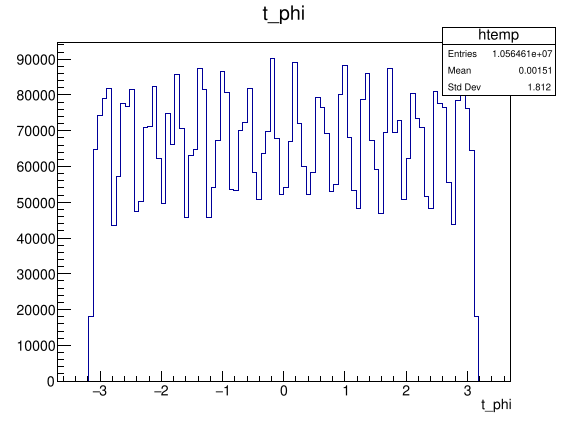

The latter treats the seeds as if they were tracks, and calculates properties
under this assumption. This means that some properties like the number the
measurements or outliers will not be filled.

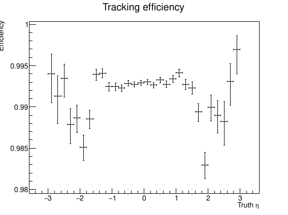

Another seeding strategy that can be configured with this separate function is
an ML based seed filtering (off by default).

```python
    if seedFilter_ML:
        addSeedFilterML(
            s,
            SeedFilterMLDBScanConfig(
                epsilonDBScan=0.03, minPointsDBScan=2, minSeedScore=0.1
            ),
            onnxModelFile=os.path.dirname(__file__)
            + "/MLAmbiguityResolution/seedDuplicateClassifier.onnx",
            outputDirRoot=outputDir if args.output_root else None,
            outputDirCsv=outputDir if args.output_csv else None,
        )

```

The next section configures the Combinatorial Kalman Filter (CKF), which is the
main work horse for track finding in ACTS. The reconstruction performance is
**very** sensitive to the exact configuration. The configuration below has been
optimized **to some degree** for ODD, and has been verified to produce
*reasonable* performance. If you intend to run this with a different geometry,
or even physics process, you might need to tune these parameters accordingly.
The selection criteria can be configured with different thresholds depending on
$\eta$.

```python
    addCKFTracks(
        s,
        trackingGeometry,
        field,
        TrackSelectorConfig(
            pt=(1.0 * u.GeV if args.ttbar else 0.0, None),
            absEta=(None, 3.0),
            loc0=(-4.0 * u.mm, 4.0 * u.mm),
            nMeasurementsMin=7,
            maxHoles=2,
            maxOutliers=2,
        ),
        CkfConfig(
            # Consider measurements below this chi2 value as valid
            chi2CutOffMeasurement=15.0,
            # If no measurement below the above chi2 cut is found, 
            # but we have one below the following value, count it as an outlier.
            chi2CutOffOutlier=25.0,
            # The maximum number of measurements to consider
            numMeasurementsCutOff=10,
            # Only run on seeds that were not included in a track yet
            seedDeduplication=True,
            # Force the CKF to incorporate measurements that are part of the 
            # input seed
            stayOnSeed=True,
            # Map volume IDs to subsystems, for subsystem-level measurement selection
            pixelVolumes=[16, 17, 18],
            stripVolumes=[23, 24, 25],
            maxPixelHoles=1,
            maxStripHoles=2,
            # Restrict track finding to these volumes
            constrainToVolumes=[
                2,  # beam pipe
                32,
                4,  # beam pip gap
                16,
                17,
                18,  # pixel
                20,  # PST
                23,
                24,
                25,  # short strip
                26,
                8,  # long strip gap
                28,
                29,
                30,  # long strip
            ],
        ),
        outputDirRoot=outputDir if args.output_root else None,
        outputDirCsv=outputDir if args.output_csv else None,
        writeCovMat=True,
    )

```

Following track finding, the next step is to *resolve ambiguities* between
track candidates. In other words, there can be multiple tracks that partially
reference clusters. In the end, except for merged clusters from multiple true
particles, a cluster should be uniquely associated to a single track. Different
strategies exist, and the script can be configured to run three of them:

The CKF tracking produces the arguably most important output artifacts: the
main track finding performance in `performance_finding_ckf.root` and the
quality and properties of the associated tracks in
`performance_fitting_ckf.root`.

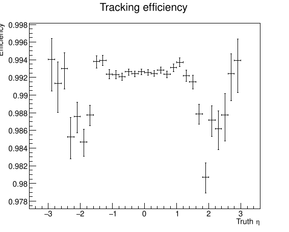
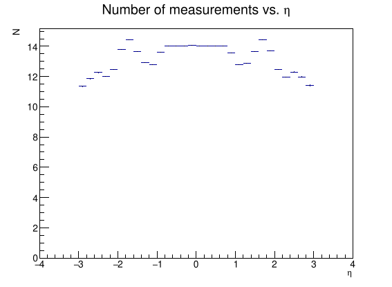

- ML based ambiguity resolution using an ONNX model
- A score based ambiguity resolver that assigns each track a score based on its
  quality and hit content, and then selects track based on the highest score.
- A *greedy* resolver, which calculates the number of shared hits for each
  tracks, and then iteratively removes the tracks with the highest fraction of
  shared hits.

```python
    if ambi_ML:
        addAmbiguityResolutionML(
            s,
            AmbiguityResolutionMLConfig(
                maximumSharedHits=3, maximumIterations=1000000, nMeasurementsMin=7
            ),
            outputDirRoot=outputDir if args.output_root else None,
            outputDirCsv=outputDir if args.output_csv else None,
            onnxModelFile=os.path.dirname(__file__)
            + "/MLAmbiguityResolution/duplicateClassifier.onnx",
        )

```

```python
    if ambi_ML:
      ...
    elif ambi_scoring:
        addScoreBasedAmbiguityResolution(
            s,
            ScoreBasedAmbiguityResolutionConfig(
                minScore=0,
                minScoreSharedTracks=1,
                maxShared=2,
                minUnshared=3,
                maxSharedTracksPerMeasurement=2,
                useAmbiguityScoring=False,
            ),
            outputDirRoot=outputDir if args.output_root else None,
            outputDirCsv=outputDir if args.output_csv else None,
            ambiVolumeFile=ambi_config,
            writeCovMat=True,
        )
```

```python
    if ambi_ML:
      ...
    elif ambi_scoring:
      ...
    else:
        addAmbiguityResolution(
            s,
            AmbiguityResolutionConfig(
                maximumSharedHits=3, maximumIterations=1000000, nMeasurementsMin=7
            ),
            outputDirRoot=outputDir if args.output_root else None,
            outputDirCsv=outputDir if args.output_csv else None,
            writeCovMat=True,
        )

```

As the ambiguity resolution stage essentially does a sophisticated track
selection, the same performance metrics that are available in
`performance_finding_ambi.root` and `performance_fitting_ambi.root`, but using
the population of tracks after the selection.

With the tracks reconstructed, we can now configure vertex reconstruction, which
will find and fit common vertices between any of the tracks that have been
reconstructed.

```python
addVertexFitting(
    s,
    field,
    vertexFinder=VertexFinder.AMVF,
    outputDirRoot=outputDir if args.output_root else None,
)
```

This will produce vertex outputs in `performance_vertexing.root`, which contains the number of vertices, which gives an indication of the efficiency of vertex reconstruction, and also the spatial and temporal resolution of the reconstructed vertices.

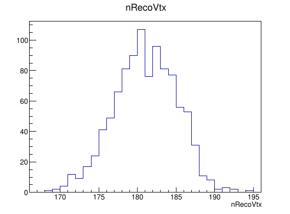
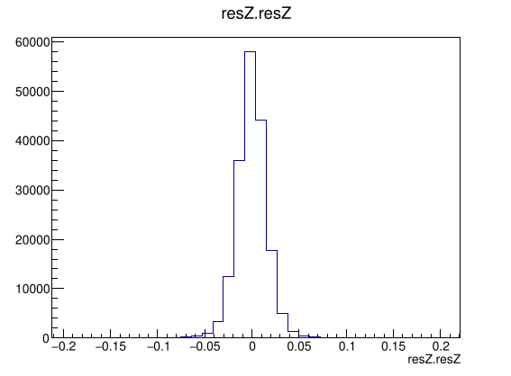

Finally, the sequence is run with this the `run()` method of the Sequencer.

```python
s.run()
```

## Known issues

### Warning about change in parameter passing in GCC11

```console
In file included from /src/Core/src/EventData/TrackParameterHelpers.cpp:12:
/src/Core/include/Acts/Utilities/VectorHelpers.hpp: In function
'std::pair<double, double> Acts::VectorHelpers::incidentAngles(const
Acts::Vector3&, const Acts::RotationMatrix3&)':
/src/Core/include/Acts/Utilities/VectorHelpers.hpp:230:47: note: parameter
passing for argument of type 'std::pair<double, double>' when C++17 is enabled
changed to match C++14 in GCC 10.1 230 |     const Acts::RotationMatrix3&
globalToLocal) { | 
```

Warnings like you can see above  come from an ABI change in GCC11 on aarch64.
This warning seems not to be actionable, the only way to suppress it is by
supplying `-Wno-psabi` to the compilation. That's a pretty generic warning
though, so we chose not to apply it by default, as it might mask future ABI
changes that are actually problematic. In CMake, you can add this flag by
adding `-DCMAKE_CXX_FLAGS="-Wno-psabi"` to your CMake command.
  
Links:

- <https://gcc.gnu.org/bugzilla/show_bug.cgi?id=111516>
